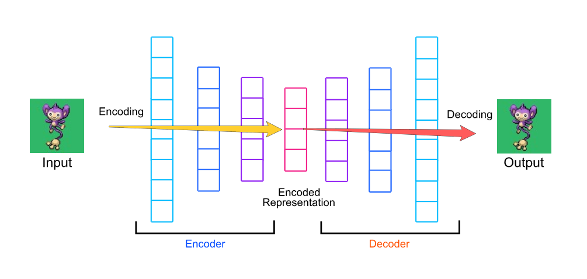

# Autoencoder

Autoencoder is a **unsupervised** artificial neural network, that learns how to reduce the dimensions, and the noise in data.

**It learns how to:**
1. efficiently compress and encode data
2. reconstruct the reduced encoded data back to a representation that is as close to the original data as possible

**Autoencoder Components:**
1. Encoder: it compresses the data into an encoded representation and reduces the dimensions
2. Bottleneck: a layer that contains the data that is compressed to the lowest dimension
3. Decoder: reconstruct the data from the encoded representation to a representation that is as close to its original data as possible
4. Reconstruction Loss: measures how the decoder performs, that is how close is the output to the original data.

**Uses:**
- Dimension reduction
- Reduce noise in data
- Generative modeling
- Efficient coding
- Superior in learning underlying features in many domains, including computer vision, speech recognition, and language modeling 

**Articles**
[Auto encoder, what is it and what is it userd for part1](https://towardsdatascience.com/auto-encoder-what-is-it-and-what-is-it-used-for-part-1-3e5c6f017726)