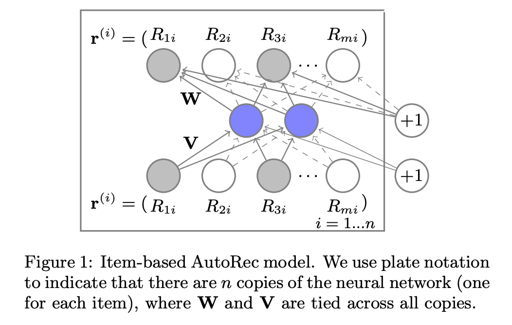

# Chapter 16: Recommender Systems

## What is recommender systems?
The **major goal** of recommender systems is to help users discover relevant items such as movies to watch, text to reach or products to buy, os as to create a delightful user experience.
Recommender systems are replacements of search engines by reducing the efforts in proactive searches and surprising users with offers they never searched for.

**Applications:**
- online shopping
- music/movie services
- mobile application stores
- online advertising

**Common model objectives:**
- predict the rating a user might give to a prospective item
- generate a recommendation list of items
- predict the click-through rate from abundant features
- cold-start recommendation, recommending for new users and recommending new items to existing users

**Challenges**
- data spacity
- cold-start

## fundamental concepts
### Collaborative Filtering (CF)
"people collaborate to help one another perform the filtering process in order to handle the large amounts of email and messages posted to newsgroups." -- Goldberg et al., 1992

In a broad sense, it is the process of filtering for information or patterns using techniques involving collaboration among multiple users, agents, and data sources.

CF techniques:
- memory-based CF
  - nearest neighbor-based CF: user-based CF and item-based CF
  - limitations: sparse and large-scale data
- model-base CF
  - latent factor models: matrix factorization
  - more popular with its better capability in dealing with sparsity and scalability
  - can be extended with neural networks, leading to more flexible and scalable models
- hybird

In general, CF only uses the **user-item interaction data** to make predictions and recommendations. 
Besides CF, **content-based** and **context-based** recommender systems are also useful in incorporating the content descriptions of items/users and contextual signals such as timestamps and locations. 

### Explicit Feedback and Implicit Feedback
Explicit Feedback
- less noise
- not always available, e.g. some users are reluctant to rate a movie
  
Implicit Feedback
- noisy, e.g. a user watched a movie does not necessarily indicate a positive view of that movie
- more available, e.g. user clicks, mouse movement, etc..

## classic models

### Matrix Factorization Model
**Input data:** 
- a user-item interaction matrix of dimension *m* X *n*. 
- m is the number of users
- n is the number of items
- the values of the matrix could be ratings given by the user for an item

for example:
|        | movie A | movie B | ... | 
| ------ | ------- | ------- | - |
| user 1 | 3       |4        ||
| user 2 | 5       |2        ||
| ...    | ...     |...      ||

**Model Description**
We factor this **m** X **n** interaction matrix into two matrices, called **P** and **Q**. Matrix **P** (user latent matrix) is of dimension **m** X **k**, and Matrix **Q** (item latent matrix) is of dimension **k** X **n**. **k** is the latent factor size.

The **i**-th column (**k** X 1) in matrix **Q** represents a list of characteristics the **i**-th movie possesses, e.g. drama, violence, etc. There are **k** such characteristics. The value measures the degree of the characteristics possessed by the **i**-th movie.

The **i**-th row (1 X **k**) in matrix **P** represents a user's preference towards the **k** characteristics.

The **k** latent factors can be obvious characterisitcs like drama or action, or it can be completely uninterpretable.

So the predicted interaction matrix is modeled as:
$$
R' = P * Q
$$
R' are the predicted ratings

**Regularization**
User/Item biase: users rate movies differently, some user tend to give high ratings and others give low rating. Some movies tend to get high ratings due to a famous star, etc.

So we add two biase terms to the model:
$$
R_{ui}' = P_u * Q_i^T + b_u + b_i
$$
$R_{ui}'$ is the predicted rating for the $u_{th}$ user and the $i_{th}$ item
**Loss function**
$$
(R - R')^2 + lamda * (||P||^2 + ||Q||^2 + b_u^2 + b_i^2)
$$
Lamda is the regularization rate.
We are penalizating the maginitude of the parameters

**Model Disadvantage**
Matrix Factorization is essentially a linear model. It has its limitations for describing nonlinear relationships, and will fail at capturing intricate features.

### [AutoRec](https://www2015.thewebconf.org/documents/proceedings/companion/p111.pdf)

What is AutoEncoder: [Autoencoder](https://towardsdatascience.com/auto-encoder-what-is-it-and-what-is-it-used-for-part-1-3e5c6f017726)

Autoencoder based recommendation models have these **advantages**:
1. can handle heterogenerous data sources(ratings, audio, video)
2. more efficient in handling input noises

Four types of autoencoders used for recommender systems:
1. Denoising Autoencoder(DAE)
2. Stacked Denoising Autoencoder(SDAE)
3. Marginalized Denoising Autoencoder(MDAE)
4. Variational Autoencoder(VA)

We have m users, n items, and a partially observed user-item rating matrix $R^{m X n}$. Each user's ratings can be represented by $r^{(u)} = (R_{u1}... R_{un})$. 
Each item can be represented by $r^{(i)} = (R_{i1}... R_{im})$.
Item-base autoencoder:
Take $r^{(i)}$ and project it to a low-dimensional latent space: $g(V*r^{(i)} + u)$.
Then reconstruct $r^{(i)}$ back to the high-dimensional space: $h(r^{(i)}, W, V, u, b) = f(W*(g(V*r^{(i)} + u)) + b)$

- f, g are activation functions
- W is m X k matrix, b is m-dimension
- V is k X m matrix, u is k-dimension

The cost function:
$$
argmin \sum_{i=1}^{n} ||r^{i} - h(r^{(i)}, W, V, u, b)||^2 + lambda * regularization
$$

How to improve the model:
1. increase the number of hidden neurons
2. increase the number of layers
3. try different activition functions
4. item-based autoRec performs better than user-based autoRec. Because the average number of ratings for every item is higher than the average number of rating given by each user.

## recent advances with deep learning in the field of recommender systems

## Datasets
[The MovieLens Dataset ](https://grouplens.org/datasets/movielens/)

## Further Readings
[First version of matrix factorization](https://sifter.org/~simon/journal/20061211.html)
[Netflix 1million USD Contest winner](https://www.asc.ohio-state.edu/statistics/statgen/joul_aut2009/BigChaos.pdf)
  - BellKor
  - Pragmatic Theory
  - BigChaos
  
  https://www.youtube.com/watch?v=LzxiFnBLnEY&ab_channel=CriteoEng
